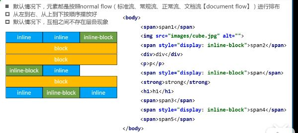
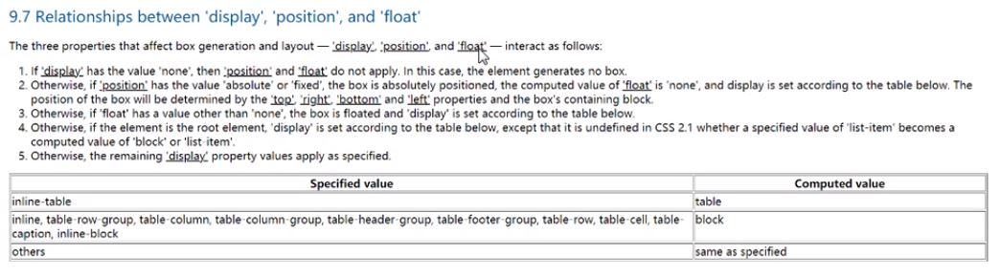
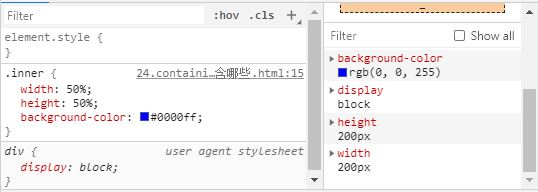
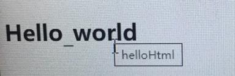
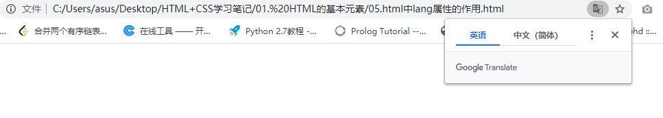
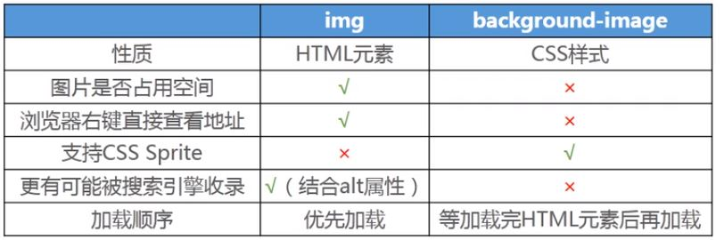

<!-- @import "[TOC]" {cmd="toc" depthFrom=1 depthTo=6 orderedList=false} -->

<!-- code_chunk_output -->

- [零 基础查询](#零-基础查询)
- [一.基础操作](#一基础操作)
  - [1 vscode一些markdown的快捷键使用](#1-vscode一些markdown的快捷键使用)
    - [1.1 markdown的vscode快捷键](#11-markdown的vscode快捷键)
    - [1.2 将md文件转化为pdf文件](#12-将md文件转化为pdf文件)
    - [1.3 插入目录](#13-插入目录)
  - [2 浏览器常用快捷键](#2-浏览器常用快捷键)
  - [3 单词](#3-单词)
  - [4 vscode的快捷键](#4-vscode的快捷键)
  - [5 markdown语法](#5-markdown语法)
  - [6 html5新增的内容](#6-html5新增的内容)
    - [6.1 head元素中charset的简化](#61-head元素中charset的简化)
  - [7 Ement语法](#7-ement语法)
  - [8 CSS的reset](#8-css的reset)
  - [9 触发BFC](#9-触发bfc)
    - [9.1 BFC的定义](#91-bfc的定义)
    - [9.2 如何触发BFC](#92-如何触发bfc)
  - [10 一些网页相关的技巧](#10-一些网页相关的技巧)
    - [利用outline来看网站的布局](#利用outline来看网站的布局)
  - [11 正则表达式](#11-正则表达式)
  - [12 水平居中的不同方式](#12-水平居中的不同方式)
    - [12.1 text-align能够用于水平居中的原因](#121-text-align能够用于水平居中的原因)
    - [12.2 水平居中的表显示：](#122-水平居中的表显示)
  - [13 CSS 标准流的理解(normal flow)](#13-css-标准流的理解normal-flow)
  - [14 脱离标准流元素](#14-脱离标准流元素)
    - [14.1 脱离标准流的属性](#141-脱离标准流的属性)
    - [14.2 脱离标准流元素的特点](#142-脱离标准流元素的特点)
    - [14.3 脱离标准流属性和display是什么关系](#143-脱离标准流属性和display是什么关系)
    - [14.4 造成高度崩塌](#144-造成高度崩塌)
  - [15 常用CSS 百分比元素相对的对象](#15-常用css-百分比元素相对的对象)
    - [15.1 the width/height/size of containing block包含哪些宽度,高度](#151-the-widthheightsize-of-containing-block包含哪些宽度高度)
    - [15.2 the width/height/size of bounding box包含哪些宽度，高度](#152-the-widthheightsize-of-bounding-box包含哪些宽度高度)
- [二 网页的基本认识](#二-网页的基本认识)
  - [1. 浏览器的内核分类](#1-浏览器的内核分类)
  - [2 浏览器解析HTML](#2-浏览器解析html)
    - [2.1 网页的基本组成](#21-网页的基本组成)
    - [2.2 标签分类](#22-标签分类)
  - [3 元素的属性](#3-元素的属性)
- [三 网页的基本学习](#三-网页的基本学习)
  - [1 文档声明](#1-文档声明)
  - [2 html元素](#2-html元素)
    - [2.1 html中的lang属性（language）](#21-html中的lang属性language)
  - [3 head元素](#3-head元素)
    - [3.1 元数据](#31-元数据)
      - [3.1.1 title元素：](#311-title元素)
      - [3.1.2 meta元素](#312-meta元素)
      - [3.1.3 style元素](#313-style元素)
      - [3.1.4 link元素](#314-link元素)
  - [4 body元素](#4-body元素)
    - [4.1 h元素](#41-h元素)
    - [4.2 p元素](#42-p元素)
    - [4.3 strong元素](#43-strong元素)
    - [4.4 不常用的元素](#44-不常用的元素)
      - [4.4.1 code元素](#441-code元素)
      - [4.4.2 br元素](#442-br元素)
      - [4.4.3 hr元素](#443-hr元素)
      - [4.4.4 点击可看使用方式](#444-点击可看使用方式)
    - [4.5 html的字符实体](#45-html的字符实体)
    - [4.6 span元素](#46-span元素)
    - [4.7 div元素](#47-div元素)
    - [4.8 img元素](#48-img元素)
    - [4.9 a元素](#49-a元素)
      - [4.9.1 a元素的行内样式](#491-a元素的行内样式)
        - [4.9.1.1 href（超链接）](#4911-href超链接)
        - [4.9.1.2 target](#4912-target)
      - [4.9.2 base元素和a元素的结合使用](#492-base元素和a元素的结合使用)
      - [4.9.3 a元素的锚点链接](#493-a元素的锚点链接)
      - [4.9.4 a元素和img元素的结合](#494-a元素和img元素的结合)
      - [4.9.5 相关代码](#495-相关代码)
- [四 有关网络的基础知识](#四-有关网络的基础知识)
  - [1 URL解析](#1-url解析)
  - [2 URL](#2-url)
    - [2.1 基本格式](#21-基本格式)
    - [2.2 具体格式](#22-具体格式)
  - [3 get和post请求](#3-get和post请求)
    - [3.1 get请求](#31-get请求)
    - [3.2 post请求](#32-post请求)
    - [3.3 代码测试](#33-代码测试)
- [五 CSS的基本使用](#五-css的基本使用)
  - [0 html的调试技巧](#0-html的调试技巧)
    - [0.1 利用div的outline属性查看div的划分](#01-利用div的outline属性查看div的划分)
  - [1 CSS的引入](#1-css的引入)
  - [2 CSS文件编码](#2-css文件编码)
    - [2.1 文件编码的设置](#21-文件编码的设置)
    - [2.2 @import 引入样式](#22-import-引入样式)
  - [3 CSS的选择器](#3-css的选择器)
    - [3.1 通配选择器](#31-通配选择器)
    - [3.2 元素选择器（标签）](#32-元素选择器标签)
    - [3.3 类选择器](#33-类选择器)
    - [3.4 id选择器](#34-id选择器)
    - [3.5 属性选择器](#35-属性选择器)
    - [3.6 后代选择器(重要)](#36-后代选择器重要)
    - [3.7 子代选择器(重要)](#37-子代选择器重要)
    - [3.8 相邻兄弟选择器](#38-相邻兄弟选择器)
    - [3.9 交集选择器(重要)](#39-交集选择器重要)
    - [3.10 并集选择器(重要)](#310-并集选择器重要)
    - [3.11 伪类选择器](#311-伪类选择器)
    - [3.12 伪元素选择器](#312-伪元素选择器)
  - [4 常见的CSS属性（1）](#4-常见的css属性1)
    - [4.1 color](#41-color)
    - [4.2 font-size](#42-font-size)
    - [4.3 backgroud-color](#43-backgroud-color)
    - [4.4 width](#44-width)
    - [4.5 heigh](#45-heigh)
  - [5 颜色的设置方式](#5-颜色的设置方式)
    - [5.1 颜色关健字(基本不会使用)](#51-颜色关健字基本不会使用)
    - [5.2 RGB颜色（颜色空间）](#52-rgb颜色颜色空间)
  - [6 常见的CSS属性（2）-- 文本属性](#6-常见的css属性2---文本属性)
    - [6.1 text-decoration](#61-text-decoration)
    - [6.2 letter-spacing和word-spacing](#62-letter-spacing和word-spacing)
    - [6.3 text-transform](#63-text-transform)
    - [6.4 text-indent](#64-text-indent)
    - [6.5 text-align](#65-text-align)
  - [7 常见的CSS属性(3) --文字](#7-常见的css属性3---文字)
    - [7.1 font-size](#71-font-size)
    - [7.2 font-family](#72-font-family)
    - [7.3 font-weight](#73-font-weight)
    - [7.4 font-style](#74-font-style)
    - [7.5 font-variant](#75-font-variant)
    - [7.6 line-height](#76-line-height)
    - [7.7 font](#77-font)
- [六 CSS的特性](#六-css的特性)
  - [1 继承(inherit)](#1-继承inherit)
  - [2 层叠 (cascade)](#2-层叠-cascade)
    - [2.1 CSS的层叠](#21-css的层叠)
    - [2.2 元素之间的层叠关系](#22-元素之间的层叠关系)
      - [2.2.1 z-index属性](#221-z-index属性)
  - [3.CSS的属性失效可能的原因、](#3css的属性失效可能的原因)
- [七 html的高阶元素](#七-html的高阶元素)
  - [1 列表](#1-列表)
    - [1.1 列表元素](#11-列表元素)
      - [1.1.1 有序列表](#111-有序列表)
      - [1.1.2 无序列表](#112-无序列表)
      - [1.1.3 定义列表](#113-定义列表)
    - [1.2 列表相关的CSS属性](#12-列表相关的css属性)
      - [1.2.1 list-style-type](#121-list-style-type)
      - [1.2.2 list-style-image](#122-list-style-image)
      - [1.2.3 list-style-position](#123-list-style-position)
      - [1.2.4 list-style](#124-list-style)
  - [2 表格](#2-表格)
    - [2.1 常用的元素](#21-常用的元素)
    - [2.2 实现细线表格](#22-实现细线表格)
    - [2.3 表格中的其他元素](#23-表格中的其他元素)
  - [3 表单](#3-表单)
    - [3.1 常用的元素](#31-常用的元素)
      - [3.3.1 form](#331-form)
      - [3.3.2  input](#332-input)
      - [3.3.3  textarea](#333-textarea)
      - [3.3.4  select, option](#334-select-option)
      - [3.3.5  button](#335-button)
      - [3.3.6  label](#336-label)
      - [3.3.7  fieldset](#337-fieldset)
      - [3.3.8  legend](#338-legend)
      - [3.3.9 使用的注意事项](#339-使用的注意事项)
- [八 html,CSS的元素类型相关](#八-htmlcss的元素类型相关)
  - [1 块级、行内级元素](#1-块级行内级元素)
    - [1.1 块级元素（block-level elements)](#11-块级元素block-level-elements)
    - [1.2 行内级元素(inline-level elements)](#12-行内级元素inline-level-elements)
  - [2 替换、非替换元素](#2-替换非替换元素)
    - [3.1 替换元素(replaced elements)](#31-替换元素replaced-elements)
    - [3.2 非替换元素(non-replaced elements)](#32-非替换元素non-replaced-elements)
  - [3 元素的具体分类](#3-元素的具体分类)
  - [4 CSS属性-display](#4-css属性-display)
    - [4.1 display的常用CSS属性](#41-display的常用css属性)
    - [4.2 display的补充CSS属性](#42-display的补充css属性)
  - [5 CSS属性-visibility](#5-css属性-visibility)
  - [6 CSS属性-overflow](#6-css属性-overflow)
  - [7 元素之间的空格](#7-元素之间的空格)
    - [7.1 行内级元素之间的空格](#71-行内级元素之间的空格)
  - [8 元素之间的嵌套关系](#8-元素之间的嵌套关系)
  - [9 CSS属性word-break](#9-css属性word-break)
  - [10 行内非替换元素的注意事项](#10-行内非替换元素的注意事项)
- [九 盒子模型](#九-盒子模型)
  - [1 内容相关的属性(content)](#1-内容相关的属性content)
    - [1.1 width](#11-width)
    - [1.2 min-width](#12-min-width)
    - [1.3 max-width](#13-max-width)
    - [1.4 height](#14-height)
    - [1.5 min-height](#15-min-height)
    - [1.6 max-height](#16-max-height)
  - [2 内边距的相关属性(padding)](#2-内边距的相关属性padding)
    - [2.1 padding-top](#21-padding-top)
    - [2.2 padding-right](#22-padding-right)
    - [2.3 padding-bottom](#23-padding-bottom)
    - [2.4 padding-left](#24-padding-left)
    - [2.5 padding](#25-padding)
  - [3 外边距的相关属性(margin)](#3-外边距的相关属性margin)
    - [3.1 margin-top](#31-margin-top)
    - [3.2 margin-right](#32-margin-right)
    - [3.3 margin-bottom](#33-margin-bottom)
    - [3.4 margin-left](#34-margin-left)
    - [3.5 margin](#35-margin)
    - [3.6 上下margin的传递](#36-上下margin的传递)
    - [3.7 上下margin的折叠(collapse)](#37-上下margin的折叠collapse)
    - [3.8 父子元素宽度的关系](#38-父子元素宽度的关系)
  - [4 边框的相关属性(padding)](#4-边框的相关属性padding)
    - [4.1 边框的宽度](#41-边框的宽度)
      - [4.1.1 border-top-width](#411-border-top-width)
      - [4.1.2 border-right-width](#412-border-right-width)
      - [4.1.3 border-bottom-width](#413-border-bottom-width)
      - [4.1.4 border-left-width](#414-border-left-width)
      - [4.1.5 border-width](#415-border-width)
    - [4.2 边框的样式](#42-边框的样式)
      - [4.2.1 border-top-style](#421-border-top-style)
      - [4.2.2 border-right-style](#422-border-right-style)
      - [4.2.3 border-bottom-style](#423-border-bottom-style)
      - [4.2.4 border-left-style](#424-border-left-style)
      - [4.2.5 border-style](#425-border-style)
      - [4.2.6 边框的样式取值](#426-边框的样式取值)
    - [4.3 边框的颜色](#43-边框的颜色)
      - [4.3.1 border-top-color](#431-border-top-color)
      - [4.3.2 border-right-color](#432-border-right-color)
      - [4.3.3 border-bottom-color](#433-border-bottom-color)
      - [4.3.4 border-left-color](#434-border-left-color)
      - [4.3.5 border-color](#435-border-color)
    - [4.4 border](#44-border)
    - [4.5 边框实现形状](#45-边框实现形状)
    - [4.6 边框的圆角](#46-边框的圆角)
      - [4.6.1 border-top-left-radius](#461-border-top-left-radius)
      - [4.6.2 border-top- right-radius](#462-border-top--right-radius)
      - [4.6.3 border-bottom-left-radius](#463-border-bottom-left-radius)
      - [4.6.4 border-bottom-right-radius](#464-border-bottom-right-radius)
      - [4.6.4 border-radius](#464-border-radius)
  - [5 CSS属性-outlotine](#5-css属性-outlotine)
  - [6 CSS属性-box-shadow， extshadow](#6-css属性-box-shadow-extshadow)
  - [7 CSS属性-box-sizing](#7-css属性-box-sizing)
- [十 CSS的其他属性补充](#十-css的其他属性补充)
  - [1 背景](#1-背景)
    - [1.1 背景图片](#11-背景图片)
      - [1.1.1 backgroud-image](#111-backgroud-image)
      - [1.1.2 backgroud-repeat](#112-backgroud-repeat)
      - [1.1.3 backgroud-size](#113-backgroud-size)
      - [1.1.4 backgroud-position](#114-backgroud-position)
      - [1.1.5 CSS Sprite（CSS精灵）](#115-css-spritecss精灵)
      - [1.1.6 CSS 图片的居中](#116-css-图片的居中)
      - [1.1.7 background-attachment](#117-background-attachment)
      - [1.1.8 background](#118-background)
      - [1.1.9 img和background-image的选择](#119-img和background-image的选择)
  - [2 光标的属性](#2-光标的属性)
    - [2.1 cursor](#21-cursor)
  - [3 定位的属性](#3-定位的属性)
    - [3.1 position](#31-position)
      - [3.1.1 static](#311-static)
      - [3.1.2 relative](#312-relative)
      - [3.1.3 absolute](#313-absolute)
      - [3.1.4 fixed](#314-fixed)
      - [3.1.5 绝对定位技巧](#315-绝对定位技巧)
  - [4 浮动](#4-浮动)
    - [4.1 CSS属性-float](#41-css属性-float)
      - [4.1.1 none](#411-none)
      - [4.1.2 left](#412-left)
      - [4.1.3 right](#413-right)
    - [4.2 CSS属性-clear](#42-css属性-clear)
      - [4.2.1 left](#421-left)
      - [4.2.2 right](#422-right)
      - [4.2.3 both](#423-both)
    - [4.3 浮动的规则](#43-浮动的规则)
      - [4.3.1 规则一](#431-规则一)
      - [4.3.2 规则二（重要）](#432-规则二重要)
      - [4.3.3 规则三](#433-规则三)
      - [4.3.4 规则四](#434-规则四)
      - [4.3.5 规则五](#435-规则五)
      - [4.3.6 规则六](#436-规则六)
    - [4.4 浮动的高度崩塌](#44-浮动的高度崩塌)
      - [4.4.1 浮动的高度崩塌的原因](#441-浮动的高度崩塌的原因)
      - [4.4.2 浮动高度崩塌的解决方法](#442-浮动高度崩塌的解决方法)
        - [4.4.2.1 方法1](#4421-方法1)
        - [4.4.2.2 方法2](#4422-方法2)
        - [4.4.2.3 方法3](#4423-方法3)
        - [4.4.2.4 方法4(推荐)](#4424-方法4推荐)
    - [4.5 多个浮动元素的顺序问题](#45-多个浮动元素的顺序问题)
  - [5 元素的层叠](#5-元素的层叠)
- [十一 元素的布局](#十一-元素的布局)
  - [1 如何选择布局类型](#1-如何选择布局类型)
  - [2 使用inline-block进行布局](#2-使用inline-block进行布局)
  - [3 使用float进行布局](#3-使用float进行布局)
    - [2.1 问题1](#21-问题1)
      - [2.1.1 解决方法1](#211-解决方法1)
      - [2.1.2 解决方法2](#212-解决方法2)
      - [2.1.3 解决方法3(最优解)](#213-解决方法3最优解)
    - [2.2 问题2](#22-问题2)
    - [2.3 布局练习](#23-布局练习)
  - [4 CSS属性-transform](#4-css属性-transform)
    - [4.1 transform常用的函数](#41-transform常用的函数)
      - [4.1.1 tanslate(x, y)](#411-tanslatex-y)
      - [4.1.2 scale(x, y)](#412-scalex-y)
      - [4.1.3 rotate(deg)](#413-rotatedeg)
      - [4.1.4 skew(deg, deg)](#414-skewdeg-deg)
    - [4.2 CSS的属性: transform-origin](#42-css的属性-transform-origin)
    - [4.3 CSS的属性: transition](#43-css的属性-transition)
    - [4.3.1 CSS的属性: transition-property](#431-css的属性-transition-property)
    - [4.3.2 CSS的属性: transition-duration](#432-css的属性-transition-duration)
    - [4.3.3 CSS的属性: transition-timing-fuction](#433-css的属性-transition-timing-fuction)
    - [4.3.4 CSS的属性: transition-delay](#434-css的属性-transition-delay)
  - [5 对于块级元素的思考](#5-对于块级元素的思考)
    - [5.1 line boxes](#51-line-boxes)
    - [5.2 各种情况下的基线](#52-各种情况下的基线)
    - [5.3 造成图片(img), inline-block在标准流中下面会有一点空隙的原因](#53-造成图片img-inline-block在标准流中下面会有一点空隙的原因)
  - [6 CSS的属性: vertical-align](#6-css的属性-vertical-align)
    - [6.1 baseline](#61-baseline)
    - [6.2 top](#62-top)
    - [6.3 middle](#63-middle)
    - [6.4 bottom](#64-bottom)
  - [7 图片的垂直居中](#7-图片的垂直居中)
    - [7.1 方法1（不推荐）](#71-方法1不推荐)
    - [7.2 方法2(推荐)](#72-方法2推荐)
- [十一 静态页面项目实战](#十一-静态页面项目实战)
  - [1 目录结构的划分](#1-目录结构的划分)
  - [2 CSS reset书写](#2-css-reset书写)
  - [3 页面结构的划分](#3-页面结构的划分)
  - [4](#4)

<!-- /code_chunk_output -->

<style>
  tabel {
    border-collapse: collapse;
    border-style: none
  }
  td {
    border-width: 1px;
    border-style: solid
  }
  
</style>
# 零 基础查询
- <a href="https://developer.mozilla.org/zh-CN/">查询CSS,HTML相关知识网站</a>  
- <a href="https://flatuicolors.com/">查询好看的颜色</a>
- <a href="https://www.caniuse.com/">查询浏览器的兼容性</a>

# 一.基础操作
## 1 vscode一些markdown的快捷键使用
### 1.1 markdown的vscode快捷键
<table> 
    <tr>
        <td>ctrl-k v</td>
        <td>Open preview to the Side</td>
    </tr>
    <tr>
        <td>ctrl-shift-v</td>
        <td>Open preview</td>
    </tr>
    <tr>
        <td>ctrl-shift-s</td>
        <td>Sync preview / Sync source</td>
    </tr>
    <tr>
        <td>shift-enter</td>
        <td>Run Code Chunk</td>
    </tr>
    <tr>
        <td>ctrl-shift-enter</td>
        <td>Run all Code Chunks</td>
    </tr>
    <tr>
        <td>cmd-= or cmd-shift-=</td>
        <td>Preview zoom in</td>
    </tr>
    <tr>
        <td>cmd-- or cmd-shift-_</td>
        <td>Preview zoom out</td>
    </tr>
    <tr>
        <td>cmd-0</td>
        <td>Preview reset zoom</td>
    </tr>
    <tr>
        <td>esc	</td>
        <td>Toggle sidebar TOC</td>
    </tr>
</table>

### 1.2 将md文件转化为pdf文件
1. Open the Markdown file
2. Press F1 or Ctrl+Shift+P
3. Type export and select below
    - markdown-pdf: Export (settings.json)
    - markdown-pdf: Export (pdf)
    - markdown-pdf: Export (html)
    - markdown-pdf: Export (png)
    - markdown-pdf: Export (jpeg)
    - markdown-pdf: Export (all: pdf, html, png, jpeg)

### 1.3 插入目录
1. Press F1 or Ctrl+Shift+P
2. input Markdown Preview Enhanced: Create TOC
3. ctrl+s in corresonding place
## 2 浏览器常用快捷键
<table>
    <tr>
        <td>F5</td>
        <td>刷新网页</td>
    </tr>
    <tr>
        <td>F11</td>
        <td>检查元素</td>
    </tr>
</table>

## 3 单词
<table>
    <tr>
        <td>plugin</td>
        <td>插件</td>
    </tr>
    <tr>
        <td>lang</td>
        <td>language 语言</td>
    </tr>
    <tr>
        <td>charset</td>
        <td>字符编码</td>
    </tr>
    <tr>
        <td>href</td>
        <td>hyper reference 超链接</td>
    </tr>
    <tr>
        <td>br</td>
        <td>break</td>
    </tr>
    <tr>
        <td>lt</td>
        <td>less than</td>
    </tr>
    <tr>
        <td>gt</td>
        <td>greater than</td>
    </tr>
    <tr>
        <td>px</td>
        <td>pixel 像素</td>
    </tr>
    <tr>
        <td>query</td>
        <td>查询</td>
    </tr>
    <tr>
        <td>fragment</td>
        <td>片段</td>
    </tr>
    <tr>
        <td>status</td>
        <td>状态</td>
    </tr>
    <tr>
        <td>rgb</td>
        <td>red green blue</td>
    </tr>
    <tr>
        <td>rgba</td>
        <td>red green blue alpha(透明度)</td>
    </tr>
    <tr>
        <td>decoration</td>
        <td>装饰</td>
    </tr>
    <tr>
        <td>transform</td>
        <td>形变</td>
    </tr>
    <tr>
        <td>indent</td>
        <td>缩进</td>
    </tr>
    <tr>
        <td>italic</td>
        <td>斜体</td>
    </tr>
    <tr>
        <td>pseudo</td>
        <td>伪装</td>
    </tr>
    <tr>
        <td>hover</td>
        <td>悬停</td>
    </tr>
    <tr>
        <td>inherit</td>
        <td>继承</td>
    </tr>
    <tr>
        <td>ol</td>
        <td>ordered list</td>
    </tr>
    <tr>
        <td>ul</td>
        <td>unordered list</td>
    </tr>
    <tr>
        <td>li</td>
        <td>list-item</td>
    </tr>
    <tr>
        <td>dl</td>
        <td>definition list</td>
    </tr>
    <tr>
        <td>dt</td>
        <td>definition term</td>
    </tr>
    <tr>
        <td>dd</td>
        <td>definition description</td>
    </tr>
    <tr>
        <td>decimal</td>
        <td>数字</td>
    </tr>
    <tr>
        <td>tr</td>
        <td>table row</td>
    </tr>
    <tr>
        <td>td</td>
        <td>table description</td>
    </tr>
    <tr>
        <td>collapse</td>
        <td>折叠</td>
    </tr>
    <tr>
        <td>placeholder</td>
        <td>占位符</td>
    </tr>
    <tr>
        <td>transparent</td>
        <td>透明的</td>
    </tr>
    <tr>
        <td>horizontal</td>
        <td>水平的</td>
    </tr>
    <tr>
        <td>vertical</td>
        <td>垂直的</td>
    </tr>
    <tr>
        <td>enctype</td>
        <td>encode type 编码类型</td>
    </tr>
    <tr>
        <td>visibility</td>
        <td>可见性</td>
    </tr>
    <tr>
        <td>overflow</td>
        <td>溢出</td>
    </tr>
    <tr>
        <td>radius</td>
        <td>半径</td>
    </tr>
    <tr>
        <td>blur</td>
        <td>模糊</td>
    </tr>
    <tr>
        <td>attachment</td>
        <td>附件</td>
    </tr>
    <tr>
        <td>cursor</td>
        <td>光标</td>
    </tr>
    <tr>
        <td>transform</td>
        <td>形变</td>
    </tr>
    <tr>
        <td>translate</td>
        <td>位移</td>
    </tr>
    <tr>
        <td>scale</td>
        <td>缩放</td>
    </tr>
    <tr>
        <td>rotate</td>
        <td>旋转</td>
    </tr>
    <tr>
        <td>skew</td>
        <td>倾斜</td>
    </tr>
    <tr>
        <td>containing box</td>
        <td>包含块(父元素)</td>
    </tr>
    <tr>
        <td>bounding box</td>
        <td>被包含块(元素本身)</td>
    </tr>
    <tr>
        <td>transition</td>
        <td>过渡</td>
    </tr>
    <tr>
        <td>duration</td>
        <td>持续时间</td>
    </tr>
</table>

## 4 vscode的快捷键
<table>
    <tr>
        <td>!</td>
        <td>自动生成一套HTML代码</td>
    </tr>
    <tr>
        <td>tab</td>
        <td>增加中行缩进</td>
    </tr>
    <tr>
        <td>shift+tab</td>
        <td>减小中行缩进</td>
    </tr>
    <tr>
        <td>alt+b</td>
        <td>在浏览器中显示</td>
    </tr>
     <tr>
        <td>ctrl+/</td>
        <td>在对应的地方打上注释</td>
    </tr>
    <tr>
        <td>ctrl+enter</td>
        <td>直接跳转到下一行</td>
    </tr>
    <tr>
        <td>alt+shift+向下键</td>
        <td>向下复制当前行</td>
    </tr>
    <tr>
        <td>ctrl+f</td>
        <td>搜索</td>
    </tr>
    <tr>
        <td>tab</td>
        <td>增加中行缩进/td>
    </tr>
    <tr>
        <td>shift+tab</td>
        <td>减小中行缩进/td>
    </tr>
    <tr>
        <td>alt+b</td>
        <td>在浏览器中显示/td>
    </tr>
    <tr>
        <td>alt+鼠标点击</td>
        <td>一次选中多个内容/td>
    </tr> 
    <tr>
        <td>alt+shift+鼠标拖动</td>
        <td>一次选中多个内容/td>
    </tr>  
    <tr>
        <td>alt+shift+f</td>
        <td>格式化某一段代码/td>
    </tr> 0
    <tr>
        <td>ctrl+k ctrl+0</td>
        <td>折叠所有的代码</td>
    </tr> 
    <tr>
        <td>ctrl+k ctrl+j</td>
        <td>展开所有的代码</td>
    </tr> 
    <tr>
        <td>ctrl+shift+L</td>
        <td>编辑所有与选中内容相同的内容</td>
    </tr> 
</table>

## 5 markdown语法
<table>
    <tr>
        <td>插入图片</td>
        <td> 不需要双引号</td>
    </tr>
    <tr>
        <td>插入链接</td>
        <td>[name](link)</td>
    </tr>
</table>

## 6 html5新增的内容
### 6.1 head元素中charset的简化
- 原来的
```html
<meta http-equiv="Content-Type" content="text/html;charset=UTF-8">
```
- 现在
```html
<meta charset="UTF-8">
```
## 7 Ement语法
<table>
  <tr>
    <td>html:5</td>
    <td>生成html5模板</td>
  </tr>
  <tr>
    <td>element1>element2...</td>
    <td>生成嵌套(即子代元素)</td>
  </tr>
  <tr>
    <td>element1+element2...</td>
    <td>生成兄弟元素</td>
  </tr>
  <tr>
    <td>element*数字</td>
    <td>生成多个并列的元素</td>
  </tr>
  <tr>
    <td>element1^element2</td>
    <td>回到上一个层级写element2</td>
  </tr>
  <tr>
    <td>(element1...)</td>
    <td>括号内看成一个整体（同级）</td>
  </tr>
  <tr>
    <td>element1#idName</td>
    <td>element的id为idName</td>
  </tr>
  <tr>
    <td>element1.className</td>
    <td>element的class为className</td>
  </tr>
  <tr>
    <td>element1[attr=val]</td>
    <td>element的attr为val</td>
  </tr>
  <tr>
    <td>element1{content}</td>
    <td>element的内容为content</td>
  </tr>
  <tr>
    <td>$*n</td>
    <td>1-n数字显示</td>
  </tr>
  <tr>
    <td>隐式标签</td>
    <td>默认为div标签</td>
  </tr>
</table>

## 8 CSS的reset
<p id="reset-css">CSS的重置</p>

```CSS
@charset "utf-8";

/* 去除内外边距 */
article, aside, blockquote, body, button, code, dd, details, 
div, dl, dt, fieldset, figcaption, figure, footer, form, h1, 
h2, h3, h4, h5, h6, header, hgroup, hr, input, legend, li, menu, 
nav, ol, p, pre, section, td, textarea, th, ul {
    margin: 0;
    padding: 0;
}

/*去除列表的list-style,比如前面的一些空格 */
ul, ol, li {
    list-style: none;
}
/* 去除a元素的下划线,以及颜色 */
a {
    text-decoration: none;
    color: #333;
}

/* i元素经常用作图标 */
i em{
    font-style: normal;
}
/* 当tab选中时,会有一个outline或者边框 */
input, textarea, button, select, a {
    outline: none;
    border: none;
}
/* 表格合并边框(折叠),将单元格之间的距离改为0 */
table {
    border-collapse: collapse;
    border-spacing: 0;
}
/* img默认是没有border,早期浏览器有border
使得img不是基线对齐而造成下面有空隙*/
img {
    border: none;
    vertical-align: middle;
}
```

## 9 触发BFC
### 9.1 BFC的定义
- block fomat context 块格式化上下文
### 9.2 如何触发BFC
- 浮动可以触发
- 设置一个元素的overflow只要不是visible
  - hidden
  - auto
  - scoll
    - <a href="#bfc-example_1">例1：上下margin-top/margin-bottom的传递解决方法</a>

## 10 一些网页相关的技巧
### 利用outline来看网站的布局
- <span id="div-outline">检查元素后点击加号增加样式</span>
```CSS
div {
  outline: 1px solid red !important
}
```

## 11 正则表达式
<table>
  <tr>
    <td>content?</td>
    <td>0个或者一个content</td>
  </tr>
  <tr>
    <td> &lt;category&gt; </td>
    <td>括号内的内容是一类，要求写这一类的具体东西</td>
  </tr>
  <tr>
    <td>{a,b}</td>
    <td>允许写[a,b]个东西</td>
  </tr>
</table>


## 12 水平居中的不同方式
### 12.1 text-align能够用于水平居中的原因
- Content centers between the left and right edges. White space on the left and right sides of each line should be equal.
  - 内容分布于作用边沿，空白部分将左右边平分
  - 行内级元素相当于父元素的文本
- 对于自身的元素
  - 对于本身的元素（若width为auto）
  - 前提：一般只有一行元素
    - 此时的width是文本以及元素类型决定
    - 本身是行列级元素：因为content只是包裹元素的文本，所以本身就已经居中了
    - 本身是块级元素：由于块级元素的content独占一行，所以文本会进行居中
  - 对于本身的元素（若width为具体的数值）
    - 本身是行列级元素：行列级元素无法设置宽高
    - 本身是块级元素：由于块级元素的content独占一行，所以文本会进行居中
- 对于子元素
  - 子元素是行列级元素包括(img),此时父元素的content有具体的宽度，所以行列级元素会居中
  - 子元素是块级元素
    - 若width是auto
      - 文本居中不是由于父元素的text-align，而是子元素继承了text-align
    - 若width是具体数值
      - 无法相对于父元素居中显示，但内容本身居中显示
- 
- [代码](04.CSS的继承和层叠/24.text-align的基本使用.html)
### 12.2 水平居中的表显示：
<table>
  <caption>元素本身内容的水平居中方法</caption>
  <tr>
    <td>块级元素</td>
    <td>加上text-align:center</td>
  </tr>
  <tr>
    <td rowspan="2">行内级元素</td>
    <td>转变为块级元素加上text-align:center</td>
  </tr>
  <tr>
    <!-- <td>行内元素</td> -->
    <td>在父元素加上text-align: center</td>
  </tr>
</table>

<table>
  <caption>子元素为行内级的水平居中，父元素为块级</caption>
  <tr>
    <td>普通文本(内容）</td>
    <td>在父元素中加入text-align: center</td>
  </tr>
  <tr>
    <td>行内元素</td>
    <td>在父元素中加入text-align: center</td>
  </tr>
  <tr>
    <td>行内替换元素</td>
    <td>在父元素中加入text-align: center</td>
  </tr>
  <tr>
    <td>行内块级元素（inline-block)</td>
    <td>在父元素中加入text-align: center</td>
  </tr>
</table>
<br>
<table>
  <caption>子元素为块级元素，父元素为块级</captino>
  <tr>
    <td>块级元素</td>
    <td>在本身属性中加入margin: auto</td>
  </tr>
</table>

- [原理性的理解](04.CSS的继承和层叠/23.水平居中的练习.html)
- 块级元素使用margin:0 auto能够居中的原理
  - 实际上是margin-left和margin-right都为auto，此时就会平分对应的margin
  - margin-left: auto margin-right: 0 块元素会位于右边
  - auto的含义：有多上就尽量分配多上

## 13 CSS 标准流的理解(normal flow)
- 默认情况下，元素都是按照normal flow（标准流、常规流，文档流(document))进行排列
  - 从左到右，从上到下顺序摆放好
  - 默认情况下，互相之间不存在层叠现象
    - 会根据元素的种类（行内级，块级元素继续宁排列）
  - 
- 在标准流中，可以使用margin、和padding对元素进行定位
  - margin可以设置负值
  - 缺点
    - 设置一个元素的margin或者padding，会影响到标准流中其他元素的定位效果
    - 不便于实现元素的层叠效果
- 标准流中行内元素的基线对齐
  - 

## 14 脱离标准流元素
### 14.1 脱离标准流的属性
- position: fixed/absolute
- float
### 14.2 脱离标准流元素的特点
- 可以随意设置宽高
- 宽高默认是由内容决定的
- 不再受标准流的约束
- 不再给父元素汇报宽高数据（即父元素认为其不存在
  - 变成block之后，但由于不知道父元素，所以不占据父元素的整行(width: auto)
### 14.3 脱离标准流属性和display是什么关系
- <span id="three-relation"> float,position,display的关系 </span>
- 
### 14.4 造成高度崩塌
- 父元素的高度为auto，子元素脱离标准流（即为绝对定位元素或浮动元素），则会造成高度崩塌
- 绝对定位造成的高度崩塌
- <a href="#height-destory">浮动元素造成的高度崩塌</a>
## 15 常用CSS 百分比元素相对的对象
### 15.1 the width/height/size of containing block包含哪些宽度,高度
- 
- 
- [代码](04.CSS的继承和层叠/25.containing-block-width包含哪些.html)
- <span color="red">the width/height/size of containing block显然只是父元素content-width, content-height</span>

### 15.2 the width/height/size of bounding box包含哪些宽度，高度
- 
- [代码](04.CSS的继承和层叠/26.bounding-block-width.html)
- <span color="red">the width/height/size of bounding block显然只是本身content-width, content-height</span>

<table>
  <tr>
    <td rowspan="2">子元素：position: relative</td>
    <td>left</td>
    <td>refer to the width of the containing block</td>
  </tr>
  <tr>
    <!-- <td></td> -->
    <td>right</td>
    <td>refer to the width of the containing block</td>
  </tr>
  <tr>
    <td rowspan="2">子元素：margin</td>
    <td>margin-left</td>
    <td>refer to the width of the containing block</td>
  </tr>
  <tr>
    <!-- <td></td> -->
    <td>margin-right</td>
    <td>refer to the width of the containing block</td>
  </tr>
   <tr>
    <td rowspan="2">子元素：transform: translate</td>
    <td>left</td>
    <td>refer to the width of the bounding block</td>
  </tr>
  <tr>
    <!-- <td></td> -->
    <td>right</td>
    <td>refer to the width of the bounding block</td>
  </tr>
</table>

# 二 网页的基本认识
## 1. 浏览器的内核分类
   - 内核的实质：渲染引擎
   - 分类
     - Trident(三叉戟):IE, 360, 搜狗
     - Gecko(壁虎): Mozilla Firefox
     - Preto -> Blink: Opera
     - Webkit: Safari, 移动端
     - webkit -> blink: chrome
   - 适配：
     - chrome，firefox，opera，safari，ie
## 2 浏览器解析HTML
### 2.1 网页的基本组成
- 标签：&lt;head&gt;
- 元素：head
### 2.2 标签分类
- 标签对：
- 单标签 : 
  - meta，img，br，input，link
  - \<br/>等等类型
## 3 元素的属性
- <开始标签 属性名="属性值"> <font color="red">最好用双引号</font>
- 公用属性：<font color="red">title,id,class</font>属性
- <font color="red">title属性的特殊效果</font>:
  - 鼠标悬停的时候，鼠标上会显示title的内容



# 三 网页的基本学习
## 1 文档声明
- <!doctype html>
  - 作用：HTML文档声明，告诉浏览器当前也i按是HTML5页面，让浏览器用HTML5的方式去识别文档
## 2 html元素
- 作用：是HTML文档的根元素（即root），一个文档只能一个，且其他所有文档的祖先元素
### 2.1 html中的lang属性（language）
- 帮助翻译工具确定要翻译的的规则（是否翻译此页）

```html
<html lang="en">...</html>
```
## 3 head元素
### 3.1 元数据
- 用来描述数据的数据
- <font color="red">head元素包含了元数据</font>
#### 3.1.1 title元素：
  - 网页的标题
#### 3.1.2 meta元素
  - 属性
    - charset="utf-8" 
      - ascii只能编英文
      - 所有网页目前使用的是utf-8编码，所以要加上编码设置utf-8
```html
<meta charset="UTF-8">
```
#### 3.1.3 style元素
  - 用于写样式(css)
#### 3.1.4 link元素
  - 作用1：引入外部的css文件
  - 作用2：引入图标
```html
<link rel="shortcut icon" href="favicon.ico" type="image/x-icon">

```
## 4 body元素
### 4.1 h元素
- 网页标题
- h1~h6
- h元素和SEO
  - SEO优化(search engine optimization)
    - 搜索引擎优化
      - 百度/搜狗/360/谷歌
      - 根据h元素的权重进行爬取
    - 建议在网页中最多只有一个h1元素
    - 乱用h元素不仅不会个网站带来好的权重，同时也有可能被搜索引擎认为是作弊
### 4.2 p元素
- 段落(paragraph)
- <font color="red">p元素中不建议使用div</font>
### 4.3 strong元素
- 粗体显示
### 4.4 不常用的元素
#### 4.4.1 code元素
- 等宽字体显示代码
  - 等宽字体实质上是设置了样式：font-family: monospace
#### 4.4.2 br元素
- \<br/> 进行换行
#### 4.4.3 hr元素
- 分割线
- 有color属性
- 很少用
#### 4.4.4 [点击可看使用方式](01.%20HTML的基本元素/06.html中的code,br,hr的使用.html)
### 4.5 html的字符实体
- 有些字符是预留出来做特殊作用的
- 基本格式：
  - &entity_name
  - &entity_number
     - \&nbsp;
       - 空格
       - 相当于样式text-indent: 2em
     - 小于 \&lt;
     - 大于 \&gt;

- [基本用法](01.%20HTML的基本元素/07.字符实体的演练.html)
- 作业练习

[作业答案](01.%20HTML的基本元素/08.实体字符的作业练习.html)
### 4.6 span元素
- 默认情况下，跟普通文本基本没有差别
- 用于区分特殊文本和普通文本，比如用来显示一些关键字
### 4.7 div元素
- 一般作为其他元素的父容器，把其他元素包住，代表一个整体
- 用于把网页分割成多个独立的部分
- [div的基本演练](01.%20HTML的基本元素/09.div元素的基本演练.html)
### 4.8 img元素
- src属性
  - <font color="red">记得使用\ (正斜杠)</font>
  - 网络地址
  - 本地地址
    - 绝对路径
      - 缺点：其位置发生改变，可能找不到图片
    - 相对路径
      - <table border="1px solid black">
          <tr>
            <td>.</td>
            <td>当前目录</td>
          </tr>
          <tr>
            <td>..</td>
            <td>上一级目录</td>
          </tr>
        </table>
- web中常见的图片格式
  - png: 静态图片，支持透明
  - jpg: 静态图片，不支持透明
  - gif: 静态图片，动态图片，支持动图
- alt的属性
  - 当图片失效或者加载失败时显示
- width的属性
  - 只设置了width，浏览器会根据图片的宽高比自动计算出height
  - width内的默认用的是px，<font color="red">如果加上px反而显示不出来，所以不需要加上</font>
[img的属性演练](01.%20HTML的基本元素/10.%20img的属性演练.html)
### 4.9 a元素
- 作用：定义超链接，用于打开新的url
#### 4.9.1 a元素的行内样式
##### 4.9.1.1 href（超链接）
- url: 协议+host+path+query
- 注意：www.baidu.com是无法自动补充
  - <font color="red">当没有href属性时</font>
    - <font color="red">无法点击</font>
  - <font color="red">当href=""或者href="#"</font>
    - <font color="red">点击完后跳转到页面的最上方</font>
  - 若想取消href跳转的默认行为，可以在click对应的事件触发函数后面return false
```javascript
  btn.onclick = function() {
    ...
    return false;
  }
```
##### 4.9.1.2 target
- <span id="a-target">链接以什么形式被点击</span>
  - _self
    - 自己，默认值，在当前标签页打开url
  - _blank
    - 空白，在新的标签打开url
  - _parent
    -  与ifame元素的使用才有效
    -  在父标签页打开，若_self则在iframe中打开网页
  - _top
    - 与iframe嵌套iframe有关
    - 在顶层标签页打开
#### 4.9.2 base元素和a元素的结合使用
  - base元素即使baseUrl，位于head中，也可以是其他公用的的属性
  - 写不完整才会拼接，写完整不会拼接
#### 4.9.3 a元素的锚点链接
- <span color="red">作用：在当前页面中进行定位</span>
- 格式
    - href="#id"（一般为id，也可以识别的）
    - 给要跳转的地方加上id
- <font color="red">a元素的伪链接</font>
  - href="javascript: js代码"
  - href="" onclick="js代码"
    - 作用：点击后执行js代码
#### 4.9.4 a元素和img元素的结合
  - 将img元素嵌套在a元素之内,实现点击图片跳转
- <a href="#a-tab-delete">如何去除a元素被tab选中</a>
#### 4.9.5 相关代码
  - [a元素的基本能使用](01.%20HTML的基本元素/11.a元素的基本使用.html)
  - [iframe元素中嵌套a元素](01.%20HTML的基本元素/13.iframe元素中嵌套a元素.html)
  - [iframe元素中嵌套iframe](01.%20HTML的基本元素/14.iframe元素中嵌入iframe元素.html)
  - [a元素的锚点链接](01.%20HTML的基本元素/16.a元素的锚点链接.html)
  - [a元素的伪链接](01.%20HTML的基本元素/17.a元素的伪链接.html)

# 四 有关网络的基础知识
## 1 URL解析

<font color="red">下图为DNS解析过程：</font>

- root DNS server(根域名服务器)
  - 根据.com/.org等后缀找到对应gTLD server IP地址
- gTLD server(顶级域名服务器)
  - 根据对应的域名(baidu.com)找到对应的Name server
- Name server(名字服务器)
  - 像本地域名服务器发送对应的IP地址

## 2 URL
### 2.1 基本格式
- protocol://hostname/path
- 协议://主机地址/路径
  - 常见协议
    - http(80),https,file,matilto,ftp
### 2.2 具体格式
= - protocol://hostname\[:port\]/path/\[:parameter\]\[?query\]#fragment

## 3 get和post请求
- 提交表单的数据时，浏览器发送的是http请求，有2中请求方法可以选择
### 3.1 get请求
- 在请求URL后面以？的形式跟上发送给服务器的参数，多个参数之间用&隔开
- 由于浏览器和服务器对URL长度有限制，所以URL后面附带的参数是有限的，通常不超过1kb
### 3.2 post请求
- 发送给服务器的参数全部放在请求体中
### 3.3 代码测试
- [post和get请求的区别](04.CSS的继承和层叠/12.post和get请求的区别.html)
- 结果
- 
- 
- 

# 五 CSS的基本使用
## 0 html的调试技巧
### 0.1 利用div的outline属性查看div的划分
```CSS
div {
  outline: 2px solid red !important
}
```
## 1 CSS的引入
- 内联样式（inline style)
  - \<p style="属性：属性值;属性：属性值">
- 文档样式表(document style sheet)
  - 在head元素中加上\<style>\</style>
  - 结构和样式分离
- 外部样式表（external style sheet)
  -  \<link rel="stylesheet" href="style.css">进行引入
     -  link中的rel不能省略，用来表示文档和资源之间的关系
     -  有rel时，type可以省略
## 2 CSS文件编码
### 2.1 文件编码的设置
- @charset "utf-8";
### 2.2 @import 引入样式
- 位于\<style>\</style>内部进行引入
- @import url('style.css');进行引入
## 3 CSS的选择器
### 3.1 通配选择器
- \*
  - 用来给所有元素做一些通用性的设置
  - 由于浏览器默认会给元素一些内外边距，一般有
```CSS
* {
  margin: 0;
  padding: 0;
}
```
### 3.2 元素选择器（标签）
- 例如div p ...
### 3.3 类选择器
- 标签加上class="className className"<font color="red">空格后面可以在加上一个新的类名</font>
  - 当多个单词时
    - 使用-进行连接：large-font
    - 使用_进行连接：large_font
    - 使用驼峰：largeFont
      - 小驼峰：第一个小写
        - html class
        - js函数
      - 大驼峰：全部首字母大小
- CSS选中
```CSS
.className {
  ...
}
```
### 3.4 id选择器
- 大的门类的划分:比如头部中间尾部的划分等等
- id在同一个页面不要重复
- 标签加上id="idName"<font color="red">空格后面可以在加上一个新的id名</font>
- CSS选中
```CSS
#idName {
  ...
}
```
### 3.5 属性选择器
- [attr]
  - 拥有attr属性
- [attr=val]
  - attr属性值正好等于val
- [attr*=val]
  - attr属性值包含val
- [attr^=val]
  - attr属性值以val开头
- [attr$=val]
  - attr属性以val结尾
- [attr|=val]
  - attr属性值等于val或者以val开头且以-作为连接符
  - 常用于lang属性上(language)
  - 一般只为html设置就行了
- [attr~=val]
  - attr的属性值包含val且val与其他单词之间必须用空格隔开

### 3.6 后代选择器(重要)
- 空格隔开
- 表示里面的直接子元素和间接子元素

### 3.7 子代选择器(重要)
- >
- 表示
- 表示里面的直接子元素
- <font color="red">p中不能代div</font>,不是别该种格式

### 3.8 相邻兄弟选择器
- \+
- 该元素<font color="red">后面紧挨</font>的兄弟元素
### 3.9 交集选择器(重要)
- 两个及以上选择器紧挨着
- 要同时符合紧挨着选择器的条件
### 3.10 并集选择器(重要)
- ,
- 只需要符合选择器中的一个即可(或者)
### 3.11 伪类选择器
- 伪类(pseudo class)
  - 动态伪类
    - :link :visited :hover :active :foucus
  - 目标伪类
    - :target
  - 语言伪类
    - lang()
  - 元素状态伪类
    - :enabled :disabled :checked
  - 结构伪类
    - :nth-child()...
  - 否定伪类
    - :not()
- :target(目标伪类)
  - 在a的锚点中,给目标的对象赋予style 
[:target的基本使用](02.CSS的基本使用/12.伪类_target伪类与a锚点的结合使用.html)
- 元素状态伪类
  - :disabled
    - 给不可用的状态(如不可用的按钮)绑定style
[disabled的使用](02.CSS的基本使用/13.伪类_元素状态伪类的使用.html)
- 动态伪类
  - a:link
    - 未访问的链接绑定style
  - a:visited
    - 已访问的链接绑定style
  - a:hover
    - 鼠标挪动到链接上绑定style
  - a:active
    - 激活的链接(鼠标在链接上长按)
    - <font color="red">hover必须放在link和visited后面才能完全生效</font>
    - <font color="red">除了a元素,:hover和:active也能用在别的元素上</font>
  - :focus
    - 当前拥有输入焦点的元素(能够接收键盘的输入)
    - 链接a元素也可以被键盘tab键选中而聚焦,所以也有:focus
    - <p id="a-tab-delete">如何去除a链接被tab选中的状态<p>
```CSS
/* 去除a元素的聚焦状态,但是还是可以选中 */
        a:focus {
            outline: none;
        }
```
```html
<!-- 去除选中的状态 -->
    <a href="#" tabindex="-1">你好</a>
```
    
  - 记忆:去买LV包,疯(f)狂哈哈哈(h a)
    - [动态伪类代码](02.CSS的基本使用/14.伪类_动态伪类.html)
- 结构伪类
  - :nth-child
    - <font color="red">会继承到子类</font>
    - :nth-child+数字
      - [nth-child+数字](02.CSS的基本使用/15.伪类_nth-child+数字.html)
    - :nth-child+n
      - [nth-child+n](02.CSS的基本使用/16.伪类_nth-child+n.html)
  - :nth-last-child
    - 见前但是需要加上倒数
  - :nth-of-type
    - 用法类似于:nth-child(),但是交集是不一样的
    - 只是数交集中相同的元素
    - [nth-of-type练习](02.CSS的基本使用/17,伪类_nth-of-type+数字/n.html)
  - :nth-last-of-type
    - 倒数
  - :first-child
    - nth-child(1)
  - :last-child
    - nth-last-child(1)
  - :first-of-type
    - nth-of=type(1)
  - :last=of-type
    - nth-last-of-type(1)
  - :only-child
    - 是父元素中唯一的子元素(本身是唯一的子元素)
    - [only-child练习](02.CSS的基本使用/18.伪类_only-child.html)
  - :only-of-type
    - 是父元素中唯一这种类型的元素(只数本类型)
  - :root
    - 根元素即html元素
  - :empty
    - 内容为空的元素(空格,子元素等等都不为空)
    - [:empty练习](02.CSS的基本使用/19.伪类_empty.html)
- 否定伪类
  - :not()
    - 括号内加入选择器
    - [:not的练习](02.CSS的基本使用/20.伪类_not().html)

### 3.12 伪元素选择器
- 把伪元素选择器看成一个元素就行了
- 实质上是一个行内元素
  - 因此在解决高度崩塌的时候需要给其display: block
- content
  - 内容为html代码
- ::伪元素或者:伪元素,为了区分写两个冒号
- ::first-letter
  - 选中第一个字母(中文就是第一个字)
- ::first-line
  - 选中第一行
- ::before
  - 一个元素的前面插入
- ::after
  - 一个元素的后面插入
- <font color="red">content可以为空,但是不能没有该元素</font>
## 4 常见的CSS属性（1）
### 4.1 color
- 前景色
  - 颜色会包含文字，下滑线以及边框(border)
### 4.2 font-size
- 文字颜色
### 4.3 backgroud-color
- 背景色
### 4.4 width
- 宽度
- auto
  - width的宽度由浏览器确定
    - 对于行列级元素，对应的宽度只是会包裹相应的内容
    - 对于块级元素，则是对应包含块(containing block)的宽度
      - 当元素没有父元素时，即相对于body的宽度，即浏览器的窗口宽度
### 4.5 heigh
- 高度
- auto
  - 元素将自动调整其高度以允许其内容正确显示
  - 当子元素脱离标准流时，则会出现高度崩塌
  - 父元素的高度为au，子元素脱离标准流（即为绝对定位元素或浮动元素），则会造成高度崩- 绝对定位造成的高度崩塌浮动元素造成的高度崩塌的现象
[常见的CSS属性](02.CSS的基本使用/02.常见的CSS属性.html)
## 5 颜色的设置方式
### 5.1 颜色关健字(基本不会使用)
- yello, red, purple ,blue, green, black, white...
### 5.2 RGB颜色（颜色空间）
- 字节存储(8 bit)
- 不同写法
  - 十进制：rgb(red(0-255), green(0-255), blue(0-255))
  - 十六进制: #red(0-ff)green(0-ff)blue(0-ff)
  - rgba(red, green, blue, alpha(0-1))<font color="red">0为全透明</font>
  - 0代表没有颜色即黑
## 6 常见的CSS属性（2）-- 文本属性
### 6.1 text-decoration
- 设置文字的装饰线
  - none
    - 无装饰线
    - <font color="red">可以用于去掉a元素默认的下划线</font>
  - underline
    - 下划线
  - overline
    - 上划线
  - line-though
    - 中划线
- <font color="red">u, ins默认加上下划线的样式</font>
### 6.2 letter-spacing和word-spacing
- letter-spacing
  - 字母间距
- word-spacing
  - 单词间距
### 6.3 text-transform
- 设置文字的大小写转化
  - capitalize
    - 首字母大写
  - uppercase
    - 所有字母大写
  - lowercase
    - 所有字母小写
### 6.4 text-indent
- 设置第一行内容的缩进
- 可以于\&nbsp;的使用转化
### 6.5 text-align
- 元素内容在元素中的水平对齐方式
  - left
    - 左对齐（默认值）
  - right
    - 右对齐
  - center
    - 中间对齐
  - justify
    - 两端对齐
    - <font color="red">实际上是将左右两边的剩余的空间分配到文字/单词的间距之间,但是对最后一行没有效果</font>
    - 若想要设置最后一行,则使用:text-align-last: justify
- <font color="red">当元素的内容是块级元素时,该块级元素由于独占一行,被认为已经居中,若该子块级元素的内容居中,使因为继承了父类的居中</font>
- 对于块级元素要谨慎使用
[text-decoration](02.CSS的基本使用/04.文本_text-decoration.html)
[letter-spacing和word-spacing](02.CSS的基本使用/05.文本_letter-spacing和word-spacing.html)
[text-transform](02.CSS的基本使用/06.文本_text-transform.html)
[text-indent](02.CSS的基本使用/07.文本_text-indent.html)
[text-align](02.CSS的基本使用/08.文本_text-align.html)
## 7 常见的CSS属性(3) --文字
### 7.1 font-size
- 决定文字的大小
- <font color="red">em:相对于父元素的字体大小</font>

### 7.2 font-family
- 用于设置文本的字体名称
- 设置字体后计算机处理过程:
  - 由操作系统中fonts里面的字体对网页字体进行设置
- 为了防止设置的字体操作系统中的无对应的字体一般设置多个字体(从左往右查找),若都没有,则设置使用默认字体
```CSS
{
  font-family: 'Courier New', Courier, monospace
}
```
- 英文字体只适用于英文,中文字体都是适用的
  - 中英文适用不同的字体:将英文字体写到前面,中文字体写在后面

### 7.3 font-weight
- 用于设置文字的粗细
  - 100|200|300|400|500|600|700|800|900
  - nonmal
  - bold
    - strong,b,h1~h6等标签的默认值

### 7.4 font-style
- 设置文字的常规,斜体显示
  - nomal
    - 常规显示
  - italic
    - 斜体
    - <font color="red">前提:font-family这种字体本身是支持倾斜的,所以有可能无效</font>
  - oblique
    - 让文字倾斜(与支不支持无关)
  - 斜体元素
    - \<i>,\<em>
      - i经常用于小图标

### 7.5 font-variant
  - small-caps
    - 小写字母变大写但只占小写字母的大小
[font-variant](02.CSS的基本使用/09.字体_font-variant.html)

### 7.6 line-height
- 两行文字<font color="red">基线的间距</font>
  - 即文字的高度+上下行距
  - 基线
    - 与小写字母x最底部对齐的线

- 由文本撑起来的高度,其中每一行所占据的高度即行高
- 高度(height)
  - 元素的整体高度
- <font color="red">用于文字垂直方向的居中</font>
  - 原理:设置行高时,上下行距会自动平分
### 7.7 font
- font的缩写属性
- 顺序
  - [font-style]  [font-variant] [font-weight]&nbsp;font-size [line-height]&nbsp; font-family
  - 前三个可以任意调换,也可以省略
  - font-family不能省略,不能调换顺序

# 六 CSS的特性
## 1 继承(inherit)
- <font color="red">一个元素如果没有设置某属性的值，就会跟随父元素的值，一个元素如果已经设置某属性的值，就使用自己设置的值</font>
- 属性是否能够继承可以查询文档
- 不能继承的属性，可以使用inherit强制继承或者使用百分比
  - [CSS的属性继承](04.CSS的继承和层叠/01.CSS的属性继承.html)
- <font color="red">CSS属性继承的是计算值，并不是当初编写属性的指定值（字面值）</font>
  - [继承的是计算值](04.CSS的继承和层叠/02.继承的注意事项.html)
## 2 层叠 (cascade)
### 2.1 CSS的层叠
- CSS允许多个相同的名字的CSS属性层叠在同一个元素上（即选中了同一个元素且设置了同一个属性的值）
  - 基本层叠
    - 使用了相同的选择器，后面一定把前面的层叠
  - 权级层叠
    - 权重
<table>
  <thead>
    <td>选择器</td>
    <td>权重</td>
  </thead>
  <tr>
    <td>!important</td>
    <td>10000</td>
  </tr>
  <tr>
    <td>内联样式 < p style="..."></td>
    <td>1000</td>
  </tr>
  <tr>
    <td>id选择器</td>
    <td>100</td>
  </tr>
  <tr>
    <td>类选择器，属性选择器，伪类选择器</td>
    <td>10</td>
  </tr>
  <tr>
    <td>元素选择器，伪元素选择器</td>
    <td>1</td>
  </tr>
  <tr>
    <td>通配符</td>
    <td>0</td>
  </tr>
</table>

    - 比较方法：从权值最大的开始比较每一种权值的数量是多少，取数量多的，若数量相同，则比较下一个权级
  - [CSS的层叠特性](04.CSS的继承和层叠/03.CSS的层叠特性.html)
### 2.2 元素之间的层叠关系
- <span id="element-cascade">"</span>
  - 标准流的元素中一般不存在层叠
  - 定位元素：定位元素会层叠到标准流元素上面
    - 定位元素之间可以使用z-index
    - 前提：定位元素：非static
  - 浮动元素:float: left/right
- 
#### 2.2.1 z-index属性
- 用来设置定位元素的层叠顺序
  - 取值可以是+, -, 0
- 比较原则：
  - 如果是兄弟关系
    - z-index越大，层叠越在上面
    - z-index相等，写在后面的那个元素层叠在上面
  - 如果不是兄弟关系
    - 各自从元素自己以及祖先元素中，找到最邻近的2个定位元素进行比较
    - 而且这2个定位元素必须设置z-index的具体数值
## 3.CSS的属性失效可能的原因、
- 选择器的优先级太低
- 选择器没有选中对应的元素
- CSS属性的使用形式不对
- 元素不支持此CSS属性
- 浏览器不支持此CSS属性
- 被同类型的CSS属性覆盖（font覆盖font-size）


# 七 html的高阶元素
## 1 列表
### 1.1 列表元素
#### 1.1.1 有序列表
- ol>li
- li是一个块级元素，且display的属性为list-item
- 当给li加上背景时，会发现序号部分并没有被加上相应的背景
  - 原因：那一部分为伪元素 ::marker 
    - 选中一个list item的marker box，后者通常含有一个项目符号或者数字。它作用在任何设置了display: list-item的元素或伪元素上
#### 1.1.2 无序列表
- ul>li
- li是一个块级元素，且display的属性为list-item
- ul的直接子元素只能是li
#### 1.1.3 定义列表
- dl>dt+dd
- 作用
  -  事物的名称，事物的描述
  -  问题，答案
  -  类别名，归属于这类的各事物
### 1.2 列表相关的CSS属性
- 由于是可以继承的，所以设置给ol，ul元素，会应用到li上
#### 1.2.1 list-style-type
- ::marker的类型，比如点或数字等等
- ul disc(实心圆), circle(空心圆), square(实心方块)
- ol decimal(阿拉伯数字), lower-roman(小写罗马数字), upper-roman(大写罗马数字)， lower-alpha(小写字母), upper-alpha(大写字母)
- 最常用的为none
```CSS
ul {
  list-style-type: none;
  margin: 0;
  padding: 0
}
```
#### 1.2.2 list-style-image
- 设置某张图片为li元素前面的标记，会覆盖list-style-image的设置
#### 1.2.3 list-style-position
- 设置li元素前面标记的位置，可以取outside，inside两个值
- 很少用，inside表示包含在内容之内
#### 1.2.4 list-style
- 缩写属性
- 一般最常用的是直接用none
```CSS
ul {
  list-style: none;
  margin: 0;
  padding: 0
}
```

## 2 表格
### 2.1 常用的元素
- table>tr>td
- table属性（一般用css调整，很少用这些属性）
  - d
  - border-spacing（CSS）
    - 用于设置单元格之间水平，垂直间距
    - 设置一个值，则水平和垂直的方向一样
- tr属性（一般用css调整，很少用这些属性）
  - 
- td属性（一般用css调整，很少用这些属性）
  - 
### 2.2 实现细线表格
- 将重叠的边框进行合并（经常使用）
```CSS
  table {
            /* 边框的宽度，样式，颜色 */
            border: 1px solid #000;
            /* table与td,td与td的边框线重叠，变成了2px */
            border-collapse: collapse
        }
  td {
            border: 1px solid #000;
    }
    /* 不需要去除间距，直接使用边框合并 */
```
- [实现细线表格](04.CSS的继承和层叠/06.实现细线表格.html)
### 2.3 表格中的其他元素
- caption
  - 表格的标题（表格和标题关联起来）
- tbody>tr>td
  - 表格的主体
- thead>tr>th
  - 表格的表头，th默认是粗体
- tfoot>tr>td
  - 表格的页脚
- 表格单元格的合并
  - rowspan="" colspan=""
  - [表格单元格的合并](04.CSS的继承和层叠/07.表格单元格的合并.html)
  - [课程表的练习](04.CSS的继承和层叠/08.课程表练习.html)

## 3 表单
### 3.1 常用的元素  
#### 3.3.1 form
- 表单
- 一般情况下，其他表单相关元素都是它的后代元素
- form的行内样式属性
  - action
    - 用于提交表单数据的请求url
  - method
    - get(默认方式) post
  - target
    - _self, _blank
    - <a href="#a-target"> a中的target </a>
  - accept-charset
    - 规定了表单提交时使用的字符编码
    - UNKNOWN为默认值，即当前文档的编码
  - enctype
    - 规定了在向服务器发送表单数据之前如何对数据进行编码
    - 区分于字符编码（仅仅是字符）
    - applicatin/x-www-form-urlencoded(默认)
    - multipart/form-data
      - <font color="red">文件上传时必须为这个值，并且method必须是POST</font>
#### 3.3.2  input
- 单行文本输入框，单选框，复选框，按钮等元素
- input的行内样式属性
  - type
    - 
  - maxlength
    - 允许输入的最大字数
  - placeholder
    - 占位文字
    - 在input中的内容为空时,显示在屏幕上的文字
  - readonly
    - 不需要写值,布尔属性
    - 只读
  - disabled
    - 不需要写值,布尔属性
    - 禁用
  - checked
    - 不需要写值,布尔属性
    - 默认被选中
  - autofocus
    - 不需要写值,布尔属性
    - 页面加载时,自动获取焦点
    - 一般用于第一输入框
  - name
    - 单选框中使用相同的name实现互斥
    - <font color="red">表单提交url中query中的key值</font>,用于区分数据类型
  - value
    - 无name有value则不需要提交,如button,其他的为提交到服务器的值(input输入框即为对应的value)
    - 表示显示的值
  - form
    - 根据哪一个表单提交
#### 3.3.3  textarea
- 多行文本框
- textarea元素的行内样式属性
  - cols: 列数
  - rows: 行数
- textarea元素的CSS属性
  - resize
    - none
      - 禁止缩放
    - horizontal
      - 水平方向可以缩放
    - vertical
      - 垂直方向可以缩放
#### 3.3.4  select, option
- 下拉选择框
- select元素的行内样式属性
  - multiple
    - 布尔属性
    - 实现多选框
  - size
    - 同时显示几项
- option元素的行内样式属性
  - selected
    - 布尔属性
    - 默认选中值
- [表单的综合练习](04.CSS的继承和层叠/09.表单相关的综合演练.html)
#### 3.3.5  button
- 按钮
- 可以使用input实现按钮
- button元素的属性
  - type
    - reset 默认值
    - button 
- [按钮的实现方式](04.CSS的继承和层叠/10.按钮的实现方式.html)
#### 3.3.6  label
- 表单元素的标题
- input和label的关系
  - 当label和iput通过id绑定时,直接点击label中的内容,可以聚焦于输入框
- [label和iput的关系](04.CSS的继承和层叠/11.label和input的关系.html)
#### 3.3.7  fieldset
- 表单元素组
#### 3.3.8  legend
- fieldset的标题
#### 3.3.9 使用的注意事项
- name值相同的radio才具备单选功能
- 属于同一类型的checkbox,name值要保持一致
- 去除input的tab键选中效果
  - <font color="red">外面的边框是由其中的outline实现的</font>
  - <a href="#a-tab-delete">与a的方法类似</a>
```CSS
input {
  outline: none;
}
```
  - 将tabindex设置为-1,
```
input
```
- 实现选中时选中框的颜色变化
  - 注意要加上border-style: solid
```CSS
input:focus {
  border-color: blue;
  border-style: solid;
}
```

# 八 html,CSS的元素类型相关
## 1 块级、行内级元素
- 根据元素的显示类型（能不能在同一行显示）
### 1.1 块级元素（block-level elements)
- 独占父元素一行
- div, p, pre, h1~h6, ul, ol, li, dl, dt, dd, table, form, article, aside, footer, header, hgroup, main, nav, section, blockquote, hr
- 若有设置宽高才和内容有关
### 1.2 行内级元素(inline-level elements)
- 多个行内级元素可以在父元素的同一行显示
- a, img, span, strong, code, iframe, label, input, button, canvas, embed, object, video, audio
- 只是包裹元素的盒子
## 2 替换、非替换元素
- 根据元素的内容类型（是否会被浏览器替换掉元素）
### 3.1 替换元素(replaced elements)
- 元素本身没有实际内容，浏览器会根据元素的类型和属性，来决定元素具体的显示内容
- img, input, iframe, video, embed, canvas
### 3.2 非替换元素(non-replaced elements)
- 元素本身是有实际内容的，浏览器会直接将其内容显示出来，而不需要根据元素的类型和属性判断到底显示什么内容
## 3 元素的具体分类
- 
- [元素分类的综合练习](04.CSS的继承和层叠/13.块级元素和行内级元素.html)
## 4 CSS属性-display
- 修改元素的显示类型
### 4.1 display的常用CSS属性
  - block
    - 让元素显示为块级元素
  - inline
    - 让元素显示为行内级元素
  - none
    - 隐藏元素, 且不占用空间
    - <p id="display-none">display: none</p>
  - inline-block
    - 让元素同时具有行内元素和块级元素的特征
    - 让元素能够和其他元素同占一行且能够设置width和height
    - 替换元素不是inline-block
    - 没有设置宽度和高度，则由内容决定的
    - 用途：
      -  让行内非替换元素(a/span等)能够设置宽高
      -  让块级元素在同一行显示
    - <a id="#">对齐方式</a>
  - [display的综合练习](04.CSS的继承和层叠/14.display的邮箱练习.html)
### 4.2 display的补充CSS属性
- 一般是浏览器自动赋予的
- 
## 5 CSS属性-visibility
- 控制元素的可见性
- visiable
  - 可见元素
- hidden
  - 隐藏元素但是占据空间
  - 对比<a href="#display-none">display:none</a>
## 6 CSS属性-overflow
- 控制内容溢出的行为
- overflow-x:设置x方向，overflow-y:设置纵方向 浏览器可能不支持
  - visible
    - 溢出的内容照样可见，默认值
  - hidden
    - 溢出的内容直接裁剪，即隐藏起来
  - scroll
    - 溢出的内容被裁剪，通过滚动的机制查看
    - 滚动条会占据宽高
  - auto
    - 根据内容是否溢出来决定是否使用滚动机制
## 7 元素之间的空格
### 7.1 行内级元素之间的空格
- 无论中间有多少个空格，换行符，都会解析成一个空格
- 解决方案
  - 将元素放在一起，中间不留空格
  - 在空格之间加上注释
  - 由于空格也是字符，所以可以在其父辈设置为font-size: 0
    - 在safari不适用
  - <a href="#float-attr">给元素加上浮动float</a>(推荐使用)
    - 不存在基线布局
## 8 元素之间的嵌套关系
- 块级元素和行内块级元素(inline-block)嵌套任意元素
  - p元素不能嵌套其他块级元素
- 行内元素(span,a,strong)不嵌套块级元素
  - 一般情况下只能包含行内元素
## 9 CSS属性word-break
- 内容根据宽度的自动换行，实际上是单词的换行，若一个单词过长，则会溢出相应的宽度
- [word-break的使用](04.CSS的继承和层叠/18.word-break属性的使用.html)
## 10 行内非替换元素的注意事项
- 以下属性对行内非替换元素不起作用
  - width, height, 上下方向的margin
- 以下属性对行内非替换元素的效果比较特殊
  - 上下方向的padding, 上下方向的border
    - 上下padding：上下会多出区域，但是该区域不占据空间
    - 上下border：上下会多出border，但是噶区域不占据空间
- 解决方法：增加属性: display: inline-block
- [行内非替换元素的注意事项](04.CSS的继承和层叠/21.行内非替换元素的注意事项.html)
# 九 盒子模型
- 
- html中的每一个元素都可以看成一个盒子
## 1 内容相关的属性(content)
### 1.1 width
- 宽度
- 固定的宽度
### 1.2 min-width
- 最小宽度
- - 当内容不够时，保持最小宽度
- 当缩小到一定程度时，保持最小宽度，出现滚动条
### 1.3 max-width
- 最大宽度(<=?>)
- 当内容不够时，与内容宽度相同
- 当内容过多时，使用overflow属性进行解决
### 1.4 height
- 高度
- 若没有设置，只由内容撑起来（行高撑起来的）
### 1.5 min-height
- 最小高度
- 当内容不够时，保持最小高度
- 当缩小到一定程度时，保持最小高度，出现滚动条
### 1.6 max-height
- 最大高度
- 当内容不够时，与内容高度相同
- 当内容过多时，使用overflow属性进行解决
## 2 内边距的相关属性(padding)
- 上右下左（顺时针）
### 2.1 padding-top
- 上内边距
### 2.2 padding-right
- 右内边距
### 2.3 padding-bottom
- 下内边距
### 2.4 padding-left
- 左内边距
### 2.5 padding
- 缩写属性
- 上右下左
- 只有三个值
  - 当左内边距没有设置时，采用右内边距的值
- 只有两个值
  - 当下内边距没有设置时，采用上内边距的值
  - 当左内边距没有设置时，采用右内边距的值
- 只有一个值
  - 全部相同
## 3 外边距的相关属性(margin)
- 上右下左（顺时针）
### 3.1 margin-top
- 上外边距
### 3.2 margin-right
- 右外边距
### 3.3 margin-bottom
- 下外边距
### 3.4 margin-left
- 左外边距
### 3.5 margin
- 缩写属性
- 上右下左
- 只有三个值
  - 当左外边距没有设置时，采用右外边距的值
- 只有两个值
  - 当下外边距没有设置时，采用上外边距的值
  - 当左外边距没有设置时，采用右外边距的值
- 只有一个值
  - 全部相同
### 3.6 上下margin的传递
- margin-top的传递
  - 如果<font color="red">块级元素的顶部线和父元素的顶部线重叠</font>，那么这个块级元素的margin-top值会传递给父元素
- margin-bottom的传递
  - 如果<font color="red">块级元素的底部线和父元素的底部线重叠，并且父元素的高度是auto</font>，那么这个块级元素的margin-bottom值会传递给父元素
- <p id="bfc-example_1">如何防止出现传递问题</p>
  - 给父元素设置padding-top/padding-bottom(让父子的顶部线或顶部线不重叠)
  - 给父元素设置border  
  - 触发BFC：设置overflow为auto/hidden
- 建议：
  - margin一般是用来设置兄弟元素之间的间距
  - padding一般是用来设置父子元素之间的间距
### 3.7 上下margin的折叠(collapse)
- 垂直方向上相邻两个margin(margin-top, margin-bottom)，有可能合并成一个margin
- 水平方向上不会出翔margin折叠
- 折叠的计算规则
  - 两个值进行比较，取较大的值
- 如何防止折叠
  - 只是设置其中一个元素的margin
- 两个兄弟级元素之间上下margin的折叠
  - 
- 父子块级元素之间的margin折叠
  - 先发生margin传递再发生margin折叠
  - 
### 3.8 父子元素宽度的关系
- the width of containing block(父元素的宽度) = margin-left + border-left + padding-left + width + padding-right + border-right + margin-right
- [宽度的关系和性质](img/block-width.JPG)
- [宽度的关系和性质](img/block-height.JPG)
## 4 边框的相关属性(padding)
### 4.1 边框的宽度
#### 4.1.1 border-top-width
- 上边框宽度
#### 4.1.2 border-right-width
- 右边框宽度
#### 4.1.3 border-bottom-width
- 下边框宽度
#### 4.1.4 border-left-width
- 左边框宽度
#### 4.1.5 border-width
- 缩写属性
- 上右下左（顺时针）

### 4.2 边框的样式
#### 4.2.1 border-top-style
- 上边框样式
#### 4.2.2 border-right-style
- 右边框样式
#### 4.2.3 border-bottom-style
- 下边框样式
#### 4.2.4 border-left-style
- 左边框样式
#### 4.2.5 border-style
- 缩写属性
- 上右下左（顺时针）
#### 4.2.6 边框的样式取值

### 4.3 边框的颜色
#### 4.3.1 border-top-color
- 上边框颜色
#### 4.3.2 border-right-color
- 右边框颜色
#### 4.3.3 border-bottom-color
- 下边框颜色
#### 4.3.4 border-left-color
- 左边框颜色
#### 4.3.5 border-color
- 缩写属性
- 上右下左（顺时针）
### 4.4 border
- border-top border-right border-bottom border-left
- 缩写属性
- width，style，color
### 4.5 边框实现形状
- 可能是矩形， 梯形， 三角形，圆形等形状 
- [边框实现形状](04.CSS的继承和层叠/20.border的形状.html)
### 4.6 边框的圆角
- 第一个值为水平方向，第二个值为竖直方向
#### 4.6.1 border-top-left-radius
#### 4.6.2 border-top- right-radius
#### 4.6.3 border-bottom-left-radius
#### 4.6.4 border-bottom-right-radius
#### 4.6.4 border-radius
  - 上左上右下右下左(顺时针)

## 5 CSS属性-outlotine
- 表示元素的外轮廓
  - <font color="red">不占据空间</font>
  - 默认显示在border，用法类似于border
- outline-width
  - 轮廓宽度
- outline=style
  - 轮廓样式
- outline-color
  - 轮廓颜色
- outline
  - 无顺序的要求
- 应用实例
  - <a href="#reset-css">除去a元素,input元素被tab选中时的轮廓效果</a>
  - <a href="#a-tab-delete">除去a元素选中时的轮廓效果</a>
  - <a href="#div-outline">用于查看网站的轮廓</a>

## 6 CSS属性-box-shadow， extshadow
- boxshadow
  - 给盒子添加阴影
  - 正则表达式：inset? && \<length\>{2,4} && \<color\>
    - inset表示将外框阴影变成内框阴影
    - 第一个length表示水平方向偏移(x)
    - 第二个lenght表示垂直方向偏移(y)
    - 第三个lenght表示模糊半径
    - 第四个lenght表示伸缩距离（在阴影原来的基础上向四周伸缩）
    - color：阴影颜色
  - &&前后顺序没有影响
- textshadow
  - 给文字添加阴影
  - 正则表达式: \<length\>{2,3} && \<color\>
  - 适用于:first-line ::first-letter

## 7 CSS属性-box-sizing
- 设置宽高时包含的部分
- content-box(默认)
  - 设置宽高的时候只是指定内容的宽高
- border-box
  - 设置宽高的时候指定内容+padding+border的宽高
- [box-sizing的对比](04.CSS的继承和层叠/22.box-sizing的练习.html)
- ie8以下: sborder-box
- w3c标准盒子模型: content-box

# 十 CSS的其他属性补充
## 1 背景
### 1.1 背景图片
#### 1.1.1 backgroud-image
- 设置元素的背景图片，<font color="red">不会撑起盒子</font>
- 会盖在backgroud-color上面
  - 下面的bgc仍然生效
- url("...")
- 可以使用, 设置多张图片，按照顺序层叠在下面（默认显示第一张）
#### 1.1.2 backgroud-repeat
- 设置背景图片需不需要平铺
- repeat（默认值）
  - 平铺
- repeat-x
  - 只在水平方向平铺
- repeat-y
  - 只在垂直方向平铺
- no repeat
  - 不平铺
#### 1.1.3 backgroud-size
- 设置背景图片的大小
- auto
  - 以背景图本身的大小进行显示
- cover
  - 缩放背景图，以完全覆盖铺满元素（会造成失真）
- contain
  - 缩放背景图，宽度或者高度铺满元素（达到对应最大值），图片保持原宽高比例
- 具体数值
  - &lt;width&gt; && &lt;height&gt;
    - 百分比：参考的是父元素的宽高，若只写一个，则按照宽度的比例缩放
    - 具体数值，若只写一个，则按照宽度缩放
#### 1.1.4 backgroud-position
- &lt;x&gt; && &lt;y&gt;
  - 具体数值
  - left,right,center,top,bottom
    - 若只设置一个，则只是设置x的值，y值为center
- <font color="red">若只设置了一个，另一个默认为center</font>
#### 1.1.5 CSS Sprite（CSS精灵）
- 是一种CSS图像合成技术，将各种小图片合并到一张图片上，然后利用CSS的背景定位来显示相应的图片部分
- 作用
  - 减少网页的http请求数量，加快网页响应速度，减轻服务器压力
  - 减小图片总大小
  - 解决了图片命名的困扰，只需要针对一张集合图片命名
- [CSS精灵的使用](05.CSS的补充属性/01.CSS的sprite使用.html)
#### 1.1.6 CSS 图片的居中
- <span id="backgroud-center">在不同分辨率的屏幕下背景图片依然居中</span>
  - background-position: center ... ，根据宽度居中
  - 不能根据图片的宽高来正确决定父元素的宽高,即对应的div必须有固定的高度，背景无法撑起父元素
#### 1.1.7 background-attachment
- scroll
  - 背景图片跟随元素一起滚动(默认值)
  - 不会随着浏览器的滚动而滚动,不会因为内容的滚动而滚动，会因为块的消失而消失
- local
  - 背景图片跟随元素以及元素内容一起滚动
- fixed
  - 背景图片相对于浏览器窗口固定、
  - 会随着浏览器的滚动而滚动,不会因为内容的滚动而滚动，会因为块的消失而消失
- [background-attachment的基本使用](05.CSS的补充属性/02.background-attachment的使用.html)
#### 1.1.8 background
- 缩写属性
- 常用格式
  - imgae position/size repeat attachment color
  - background-size可以省略，不省略必须跟在background-position后面
  - 都可省略顺序任意，/是不能省的
#### 1.1.9 img和background-image的选择
- 
- img: 作为网页内容的重要组成部分。比如广告图片，logo等等
- background-img: 可有可无，让网页更加美观
## 2 光标的属性
### 2.1 cursor
- 光标在元素上面显示的样式
- auto(默认值)
  - 浏览器根据上下文决定指针的显示样式，如根据文本和非文本的指针样式
- default
  - 有操作系统决定，一半显示小箭头
- pointer
  - 一只小手
- text
  - 一条竖线
- none
  - 光标消失
## 3 定位的属性
### 3.1 position
- <font color="red">left, right, top, right分别在对应的方向增加像素，而不是移动</font>
#### 3.1.1 static
- 静态定位（（默认值）
  - 按照normal flow进行布局
  - left, right, top, bottom没有任何作用
#### 3.1.2 relative
- 相对定位
  - <font color="red">left, right百分比相对于containing-box-width</font>
  - 元素按照normal flow进行布局
    - 在normal flow中且占据空间
  - 可以通过left，right，top，bottom进行定位
    - 定位的对象是自己原来是的位置
  - <font color="red">通过定位，仍然占据着对应normal flow的空间</font>
- 作用：
  - 对元素进行微调
- 练习
  - 已知sub，sup元素分别对应的上标和下标，使用相对定位对其进行微调，展示成：
    - 
    - [答案](05.CSS的补充属性/04.相对定位的练习1.html)
  - 将图片一直保持居中
    - <a href="#backgroud-center">方法一</a>
    - 利用positive: relative
      - 移动距离：img-width * 0.5 - div-width * 0.5
      - 具体过程
        - 先左向移动 right: img-width*0.5
        - margin-left: 50% / left: 50%
          - 相对于containing-box的宽度
        - 注意百分比相对的对象
    - [答案](05.CSS的补充属性/05.相对定位的练习2.html)
#### 3.1.3 absolute
- 绝对定位
  - 一层一层往父元素找，直到找到非static的块然后根据该块进行定位
  - 最邻近的定位祖先元素（非static）
    - 如果找不到这样的祖先元素，则参照对象是视口
    - 即relative, absolute, fixed
- 元素脱离标准流
- left, right, top, bottom
- 子绝父相
  - 在绝大多数情况下，子元素的绝对定位都是相对于父元素进行定位的
  - 如果希望子元素相对于父元素进行定位，而不希望父元素脱标
    - 父元素使用position: relative
    - 子元素使用position: absolute
- [绝对定位的演练](05.CSS的补充属性/08.绝对定位的演练.html)
- 练习
  - [绝对定位，考拉商品展示](05.CSS的补充属性/09.绝对定位-考拉的商品展示.html)
  - [绝对定位，考拉的二维码](05.CSS的补充属性/10.绝对定位-考拉的二维码.html)
#### 3.1.4 fixed
- 固定定位
  - 相对于浏览器的视口进行定位
  - left, right, bottom, top
- 元素脱离标准流(normal)，不再占据空间
- 窗口滚动对应的元素不会滚动
- [固定定位的演练](05.CSS的补充属性/06.固定定位的演练.html)
- [练习题](05.CSS的补充属性/07.考拉侧边栏的固定定位.html)
#### 3.1.5 绝对定位技巧
- 绝对定位元素
  - position值为absolute或者fixed的元素
  - 对于绝对定位的元素
    - 定位参照对象的宽度(containing element) = left + right + margin-left + margin-right + 绝对定位元素的实际占用宽度
    - 定位参照对象的高度(containing element) = top + bottom + margin-top + margin-bottom + 绝对定位元素的实际占用高度
  - 如果希望绝对定位元素的宽高和定位参照对象一样，，可以给绝对定位属性赋予
    - left: 0 right: 0 top: 0 bottom: 0 margin: 0
  - 如果希望绝对定位元素在参照对象中居中显示，可以给绝对定位元素设置
  - <font color="red">前提：具体对象的宽高小于定位对象的宽高</font>
    - left: 0 right: 0 top: 0 bottom: 0 margin: auto
    - 设置内容的宽高
## 4 浮动
- 会让元素脱离标准流
- 作用
  - 解决inline-block水平方向的间隔问题
  - 进行布局
### 4.1 CSS属性-float
#### 4.1.1 none
- 不浮动，默认值
#### 4.1.2 left
#### 4.1.3 right
### 4.2 CSS属性-clear
- <span id="clear-atr">常用于解决浮动的高度崩塌的问题</span>
#### 4.2.1 left
- 要求元素的顶部低于之前生成的所有左浮动元素的底部
#### 4.2.2 right
- 要求元素的顶部低于之前生成的所有右浮动元素的底部
#### 4.2.3 both
- 要求元素的顶部低于之前生成的所有左、右浮动元素的底部
### 4.3 浮动的规则
#### 4.3.1 规则一
- 元素一旦浮动
  - 脱离标准流
  - 朝着向左或向右方向移动，直到自己的边界<font color="red">紧贴着包含块(containing block 一般是父元素)或者其他浮动元素的边界</font>为止
#### 4.3.2 规则二（重要）
- 浮动元素虽然脱离了标准流不能与行内级元素内容层叠，行内级内容会被浮动元素推出
  - 行内级元素，inline-block元素,<font color="red">块级元素的内容</font>
- 
  - strong设置了float:left
  - div为display:inline-block
- 
  - 产生了文字的环绕效果
#### 4.3.3 规则三
- <font color="red">行内级元素，inline-block元素</font>浮动后，其顶部将<font color="red">与所在行的顶部对齐</font>
- 
  - 未对img和div(inline-block)实现float
- 
  - 对img和div(inline-block)实现float
  - 显然行内级元素，inline-block元素浮动后，其顶部将与所在行的顶部对齐
  - 会发现：
    - div(inline-block)加上float之后会产生警告
      - block和inline-block产生冲突
      - <a href="#three-relation">参考该表格</a>
- 对三个规则的理解：[视频](https://www.bilibili.com/video/BV1kJ411x7Yn?p=183)
- 
  - 原图
    - div中套入两个div元素
- 
  - 给下方的div设置float:left
    - 上方不是行内元素且不是浮动元素，没有脱离标准流，依然占据整行
    - 下方div，只会在所在行的顶部浮动
- 
  - 给上方的div设置float:left
    - 上方div脱离了标准流且置于所在行的顶部不占据改行，此时下方div在标准流中，自然会移动到改行
    - 浮动元素会层叠标准流的元素
- 
- 
  - 在上方条件的基础上该下方的div加上display:inline-block或者加上文本
  - 行内级元素，inline-block，包含块内容不会和浮动元素重叠，而是会被推出去
- 
  - 两个都设置浮动
- 
  - 删去包含块的宽高，且div都设置浮动
  - 由于两个div脱离了标准流，所以包含块无法得知包含内容的宽高，即认为不包含任何元素，所以宽度为0
#### 4.3.4 规则四
- 如果元素向左(右)浮动，浮动元素的左（右）边界不能超出包含块的边界
- 
  - 注意包含块的padding是在外面的，即不能超过content的边界
#### 4.3.5 规则五
- 浮动元素之间不能重叠
  - 如果一个元素浮动，另一个元素已经在那个位置，后浮动元素将紧贴着前一个浮动元素（左浮找左浮，右浮找右浮）
  - 如果水平方向剩余的空间不够显示浮动元素，浮动元素将向下移动，直到有充足的空间为止
    - 
#### 4.3.6 规则六
- 浮动元素的顶部不能超过包含块的顶端，也不能超过之前所有浮动元素的顶端
  - 
    - 下一个浮动元素的排列就不能超过顶部2
### 4.4 浮动的高度崩塌
- <span id="height-destory"> 由于子元素脱离标准流造成的高度崩塌</span>
#### 4.4.1 浮动的高度崩塌的原因
- 当浮动元素的父元素有确定的高度时，不存在高度崩塌现象
- 当浮动元素的父元素的高度为auto，即高度是由其包含的内容决定的时候，当其子元素都设置为浮动元素，即子元素都脱离了标准流，则其父元素的高度会变成0，因此造成了高度崩塌
- 父元素的高度为au，子元素脱离标准流（即为绝对定位元素或浮动元素），则会造成高度崩- 绝对定位造成的高度崩塌浮动元素造成的高度崩塌的现象
#### 4.4.2 浮动高度崩塌的解决方法
##### 4.4.2.1 方法1
- 给对应的浮动元素的父元素给予具体的高度
  - 扩展性不好（不推荐）
##### 4.4.2.2 方法2
- 增加隔断层
- 在<font color="red">父元素外面的第一行</font>增加<font color="red">一个空的块级子元素</font>，并将其设置为clear:both或者增加br标签:&lt;br clear="all"&gt;
  - <font color="red">父元素依然没有高度</font>
  - 会增加许多无意义的空标签，维护起来麻烦
  - 违反了结构与样式分离的原则(不推荐)
- <a href="#clear-atr">了解clear属性</a>
##### 4.4.2.3 方法3
- 在<font color="red">父元素里面最后</font>增加一个空的<font color="red">块级子元素</font>，并将其设置为clear:both或者增加br标签:&lt;br clear="all"&gt;
  - 会增加许多无意义的空标签，维护起来麻烦
  - 违反了结构与样式分离的原则(不推荐)
  - <font color="red">父元素有高度</font>
##### 4.4.2.4 方法4(推荐)
- 使用伪元素::after在父元素里面的最后一行增加对应的有clear:both属性的空块级标签(推荐)
  - ::after默认是行内级元素
    - <font color="red">变成块级元素</font>
### 4.5 多个浮动元素的顺序问题
- 在html代码中位于前端的元素先进行浮动
```CSS
 .container::after {
   clear: both;
   display: block;
 }
```
## 5 元素的层叠
- <a href="#element-cascade">定位元素的层叠</a>


# 十一 元素的布局
## 1 如何选择布局类型
- 
- 层叠类型：即那种hover之后会显示出其他选项的类型
- 浮动布局常用于解决块之间的间隔等等
- position: relative用于解决微调
## 2 使用inline-block进行布局
- 缺陷
  - 由于inline-block元素并没有脱离标准流，所以在布局的时候，会进行基线对齐
    - 当对应的块中有文字的时候，基线对齐会导致块水平方向参差不齐
      - 
## 3 使用float进行布局
### 2.1 问题1
- 在进行布局时，同一行多个元素摆放后，设置margin-right让他们之间产生间距，那么最后一个元素设置的margin-right总是多余的？如何解决？
#### 2.1.1 解决方法1
- 每一行的最后一个元素，总是加上一个特殊的class，通过类选择器去除这个margin
#### 2.1.2 解决方法2
- 通过伪类选择器(:nth-child())
  - 存在兼容性的问题
- [详细见代码](06.网页的布局/05.addional_margins_of_items_methods2.html)
#### 2.1.3 解决方法3(最优解)
- .container 固定宽度>.warp+负margin(数值为margin-right) > 很多items
- [详细见代码](06.网页的布局/03.addional_margins_of_items_methods3.html)
### 2.2 问题2
- 在进行布局时，同一行多个元素摆放后，设置border之后，元素的两边都会产生border且会出现border的重叠，应该如何解决border的重叠问题呢？
- .container>很多items(float:解决间隔)+全部border+负margin(数值为border-width)
  - margin-right的负值可以让兄弟元素向对应的位置偏移
  - 具体步骤参考
  - [考拉案例2](06.网页的布局/05.addional_margins_of_items_methods2.html)
- .container>warp+两边的border>很多item两边的border
### 2.3 布局练习
- [京东案例](06.网页的布局/01.jd.html)
- [考拉案例1](06.网页的布局/05.kaola1.html)
  - 实现以下布局
    - 注意采用inline-block和float的区别
  - 
- [考拉案例2](06.网页的布局/05.kaola2.html)
  - 实现以下布局
    - 注意边框的重叠z
  - 
- [考拉案例3](06.网页的布局/05.kaola3.html)
  - 实现以下布局
    - 注意规则六中浮动元素顶部的影响
  - 
## 4 CSS属性-transform
- 允许旋转，缩放，倾斜或平移给定元素
### 4.1 transform常用的函数
#### 4.1.1 tanslate(x, y)
- 对元素实现平移
- 值类型
  - 数字
  - 百分比
    - <font color="red">参照元素本身(refer to the size of bounding box)</font>
      - width of size of bounding = border-width + padding-width + content-width 
      - [证明包含关系的代码](06.网页的布局/07.transform的translate()百分比指向.html)
- 适用场景
  - 如果只需要一个元素而不影响其他元素的位置，可以考虑用translate
  - 实现动画的平移
  - position: absolute中辅助元素居中
#### 4.1.2 scale(x, y)
- 对元素实现缩放
- 一个值的时候，同时设置x,y
  - 数字：
    - 1 保持不变
    - 2 放大一倍
    - 0.5 缩小一半
  - 不支持百分比
#### 4.1.3 rotate(deg)
- 元素默认以中心点作为旋转中心点
- deg
  - 正数：顺时针
  - 负数：逆时针
- 可以利用transform-origin改变旋转原点
#### 4.1.4 skew(deg, deg)
- 将元素进行倾斜

### 4.2 CSS的属性: transform-origin
- 一个值：
  - 设置x轴的原点
- 值
  - <length> 从左上角开始算
  - 百分比 参考元素大小本身
  - left, center, right, top, bottom等关键字
### 4.3 CSS的属性: transition
- 用于做过渡动画
- 需要有事件进行触发，如:hover, @click...
- 缩写属性(顺序)
  - transition-property transition-duration transition-timing-fuction transition-delay
### 4.3.1 CSS的属性: transition-property
- 指定对哪一个属性应用对应的动画
  - 可以写all表示所有可动画的属性
  - 属性是否支持动画可查官方文档
    - 常用: width, height, transform
### 4.3.2 CSS的属性: transition-duration
- 指定过渡动画所需要的时间
  - 单位是s或ms
### 4.3.3 CSS的属性: transition-timing-fuction
- 指定动画的变化曲线
  - <a href="https://developer.mozilla.org/zh-CN/docs/Web/CSS/transition-timing-function">参考网站</a>
### 4.3.4 CSS的属性: transition-delay
- 过渡动画执行之前的等待时间
## 5 对于块级元素的思考
### 5.1 line boxes
- 一个div没有设置高度的时候，会不会有高度
  - 没有内容，没有高度
  - 有内容，内容撑起高度
- 内容撑起高度的本质是什么
  - 内容有行高(line-height)，行高撑起了高度
- 行高为什么可以撑起高度？
  - 块级元素中因为line-boxes的存在，并且line-boxes有一个属性，必须包裹住所在行的所有内容(块级元素的内容或者行列级元素(img, span, inline-block等等)),由每一行的line-boxes相加构成了div的高度
- [图片辅助理解](img/ex11.JPG)
- [图片辅助理解](img/ex12.JPG)
  - 默认基线对齐
### 5.2 各种情况下的基线
- 存在文本的基线
  - x单词的底部
    - 不是文本的最底部
- 图片的基线：
  - 图片的底部线
- (inline-block)块级元素（没有文本）的基线
  - 块级元素的底部线（margin-bottom的底部）
- (inline-block)块级元素（有文本）的基线
  - 最后一行文本的x基线
- 解释以下的现象
  - [基线对齐的例子](img/q1.JPG)
    - 行内级元素，有文本的基线在单词x的下方，图片的基线在底部
    - inline-block在有文本的时候基线在文本的最后一行的单词x的下方
### 5.3 造成图片(img), inline-block在标准流中下面会有一点空隙的原因
- <font color="red">父元素没有设置具体的宽度</font>
- line-boxes会包裹全部内容，而默认预留一点去包含全部的字母
- img，inline-block的基线在底部，会默认与文本字母x的基线对齐
- line-boxes包含全部字母及与x的基线对齐，造成了下方会有一点点空隙
- - [图片辅助理解](img/ex13.JPG)
## 6 CSS的属性: vertical-align
- 会影响行内级元素在一个行盒中垂直方向的位置
- <font color="red">与父元素的高度无关，即只关注line-boxes，不关注height</font>
### 6.1 baseline
- 基线对齐（默认值）
### 6.2 top
- 让对应的行列级元素或者inline-block跟line boxes的顶部对齐
- [对应的代码](06.网页的布局/08.vertical-align的基本使用.html)
  - 
  - 
  - 
  - 
    - 解释图2和图4的产生该种现象的原因
      - 由于最大height下面的间隙消失，导致其他行内级元素需要重新找到新的基线
        - 该基线为所有其他行内元素置顶之后选取最低的
### 6.3 middle
- 让对应的行列级元素或者inline-block的中心点与父盒基线加上x-height一半(两者和的一半）的线对齐
- 父盒基线
  - 最后一行的基线（文本x，图片基线等等）
- [对应的代码](06.网页的布局/08.vertical-align的基本使用3.html)
  - 
  - 
  - 
  - 
### 6.4 bottom
- 让对应的行列级元素或者inline-block跟line boxes的顶部对齐
- 使用该方法不会导致像使用top一样其他行内元素要重新去找对应的基线
- [对应的代码](06.网页的布局/08.vertical-align的基本使用2.html)

## 7 图片的垂直居中
### 7.1 方法1（不推荐）
- 已知父盒元素的高度，想让一张图片在父盒中处置居中(.box>img)
```CSS
.box {
  width: x px;
  height: y px;
  /* 重点 */
  line-height: y px;
  font-size: 0px
}
img {
  vertical-align: middle
}
```
- 缺点
  - 父盒中不能包含有任何文字（包括内容的文字或者行列级的文字，否则会造成下沉）
### 7.2 方法2(推荐)
- 利用相对定位
- 已知父盒元素的高度，想让一张图片在父盒中处置居中(.box>img)
```CSS
.box {
  width: x px;
  height: y px;
  /* 重点 */
  position: relative;
}

img {
  position: absolute;
  /* 相对于父元素的高度 */
  top: 50%;
  /* 相对于自己的高度 */
  transform: translate(0, -50%)
}
```
- 类似于利用相对定位实现水平居中
# 十一 静态页面项目实战
## 1 目录结构的划分
- 建立index.html 代码的入口
- 建立CSS文件夹
  - 建立reset.css，用于存放初始化的CSS
  - 建立common.css,用于存放公有的CSS
- 建立js文件夹
- 建立assets文件夹
  - 建立img文件夹
  - 建立font文件夹
## 2 CSS reset书写
- 直接复制即可
## 3 页面结构的划分
- id: header
- id: top
- id: main
- id: footer
- 每一个id单独占用一个css文件夹
## 4 
- 样式从外开始写
